# Tell The World — Architecture Snapshot

**Date:** 2026-08-10
**Written after:** the "Option B foundation" refactor roadmap (PRs #10–#15) —
generated Supabase types, the `lib/data/` query layer, shared `Avatar` /
`RoleBadge` / `Pagination` UI primitives, the 4 large-file splits, and full
pagination on the directory + all 5 admin tabs. See [README.md](README.md)
for how this snapshot fits into the doc history.

This is a structural reference for developers joining the project: how a
request flows through the app, how pages/components/data connect, and how
the pieces are supposed to talk to each other. It is not a tutorial — for
setup and day-to-day conventions see [`CONTRIBUTING.md`](../../CONTRIBUTING.md).

---

## 1. Tech stack

- **Next.js 16** (App Router), **React 19**, **TypeScript**, **Tailwind CSS 4**
- **Supabase**: Postgres + Auth (Google/LinkedIn OAuth + magic link, no
  passwords) + Row Level Security
- **Resend** for transactional email
- **TipTap** for the admin brief rich-text editor
- **Playwright** for end-to-end tests
- **Bun** for package management/scripts (not npm/npx/node — see repo
  `CLAUDE.md`)
- Middleware lives in `proxy.ts` at the repo root — this is the Next.js 16
  name for what used to be `middleware.ts`.

---

## 2. System context

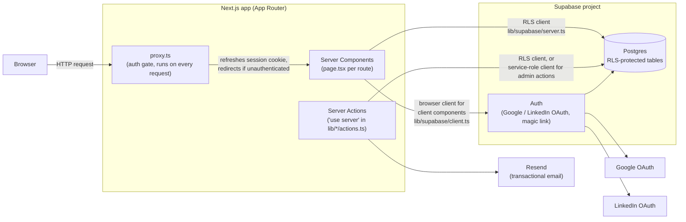

**Three Supabase clients**, chosen deliberately per context (`lib/supabase/`):

| Client | File | Where used | RLS |
| --- | --- | --- | --- |
| Browser | `client.ts` | Client components (`'use client'`) | Enforced |
| Server (RSC) | `server.ts` | Server Components, Server Actions, `proxy.ts` — cookie-based session | Enforced |
| Admin | `admin.ts` | Admin server actions only (`lib/admin/*`) — service-role key | **Bypassed** |

`admin.ts` is `import 'server-only'` and lazily initializes so a missing
`SUPABASE_SERVICE_ROLE_KEY` doesn't crash the build — only throws when an
admin action actually runs.

---

## 3. Request lifecycle — `proxy.ts`

Every request (except `_next/static`, `_next/image`, and static assets) runs
through `proxy.ts` before reaching a page:

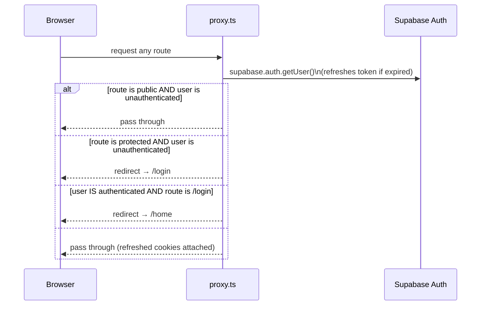

Public routes (`proxy.ts`): `/`, `/login`, `/apply`, `/apply/pending`,
`/apply/rejected`, anything under `/auth/*` (OAuth callback), anything under
`/briefs/*` (public brief pages — the *page itself* decides what content a
logged-out visitor sees, via RLS, not the proxy).

This is a **coarse gate only** — it decides "logged in or not," nothing
role-specific. Admin access is a separate, additional check done at the page
level (`app/admin/**`) and enforced again inside every admin server action
via `requireAdmin()` (see [§8 Security model](#8-security-model)).

---

## 4. Route map

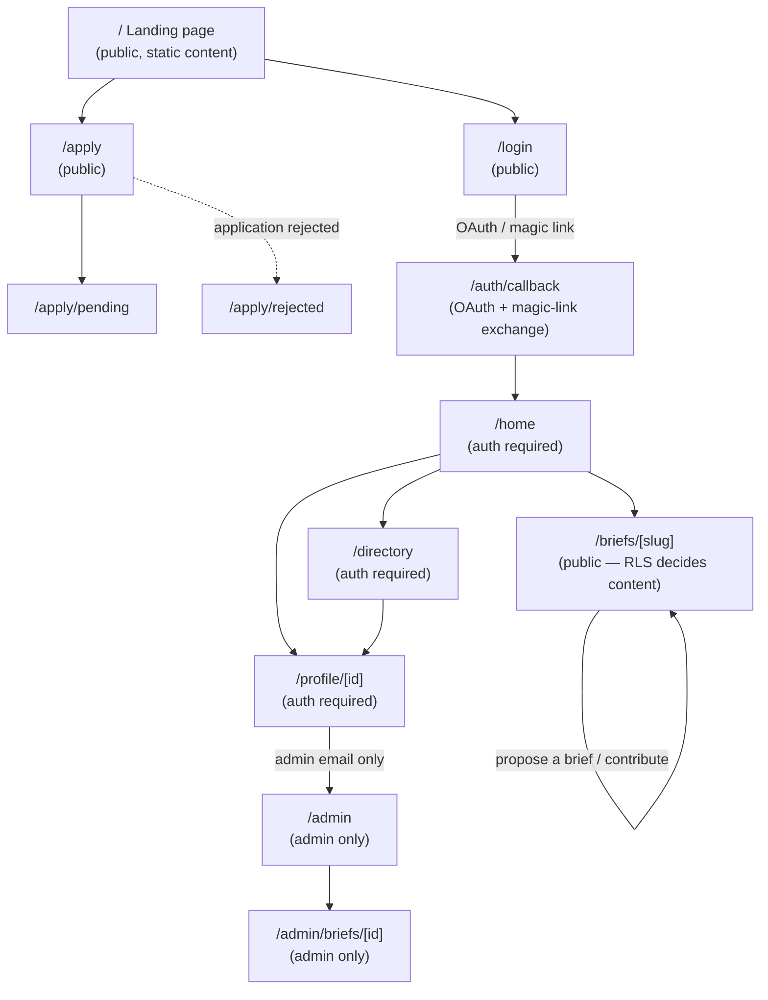

| Route | Auth | Server component | Client view |
| --- | --- | --- | --- |
| `/` | public | `app/page.tsx` | — (all inline, static mock content) |
| `/login` | public | `app/login/page.tsx` | inline `LoginForm` |
| `/apply` | public | `app/apply/page.tsx` (client) | inline, uses `form-fields.tsx` + `role-sections.tsx` |
| `/apply/pending`, `/apply/rejected` | public | static pages | — |
| `/auth/callback` | public | `app/auth/callback/route.ts` (route handler) | — |
| `/home` | required | `app/home/page.tsx` | — (server-rendered) |
| `/directory` | required | `app/directory/page.tsx` | `DirectoryView.tsx` |
| `/profile/[id]` | required | `app/profile/[id]/page.tsx` | `ProfileView.tsx` |
| `/briefs/[slug]` | public, RLS-scoped | `app/briefs/[slug]/page.tsx` | `BriefView.tsx` |
| `/admin` | admin email only | `app/admin/page.tsx` | `AdminScreen.tsx` |
| `/admin/briefs/[id]` | admin email only | `app/admin/briefs/[id]/page.tsx` | `EditBriefScreen.tsx` |

**Convention** (per `CONTRIBUTING.md`): each screen is a `page.tsx` server
component (auth check + data fetch) handing off to a client `*View.tsx`
component that owns rendering and interaction state.

---

## 5. Page-by-page component trees

### Directory (`/directory`)

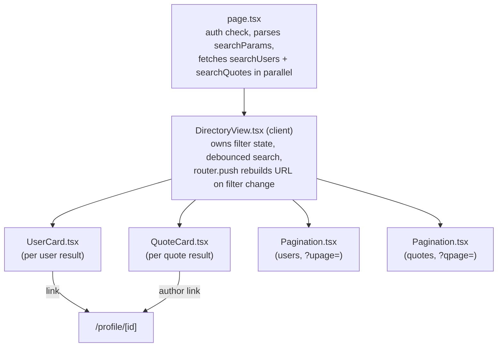

Filters (`q`, `role`, `language`, `topic`, `availability`) and both page
numbers (`upage`, `qpage`) live in the URL, not component state — changing a
filter resets both page numbers to 1.

### Profile (`/profile/[id]`)

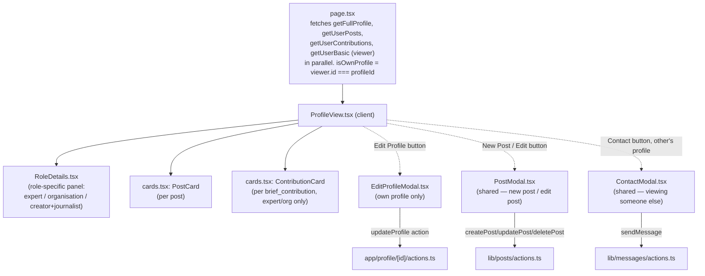

`app/profile/[id]/page.tsx` still serves two **hardcoded** profiles
(`mock-expert`, `mock-creator`) for design preview without touching the DB —
flagged as a Phase 2 cleanup item, still present.

### Brief page (`/briefs/[slug]`)

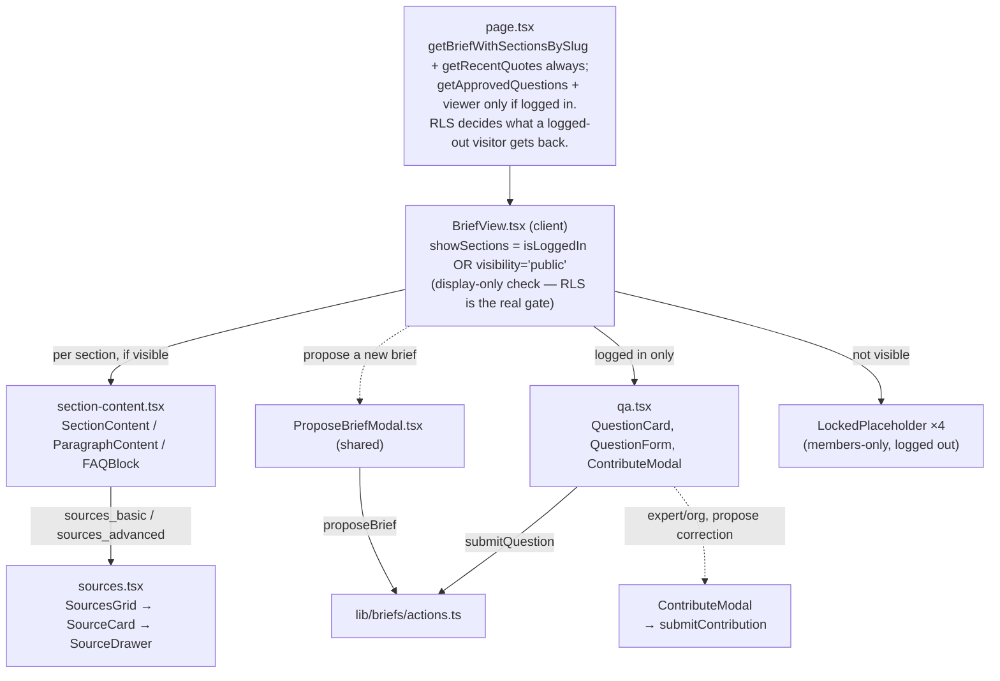

### Admin (`/admin`, `/admin/briefs/[id]`)

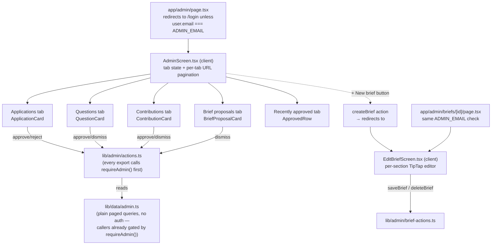

**Note on the auth gate**: the admin pages check a single hardcoded
`ADMIN_EMAIL` env var, not a DB `role='admin'` check — there is exactly one
admin account. The page-level check only protects the UI; every action in
`lib/admin/actions.ts` and `lib/admin/brief-actions.ts` independently calls
`requireAdmin()` as its first line, because server actions are public HTTP
endpoints regardless of what the page around them checks.

### Apply (`/apply`)

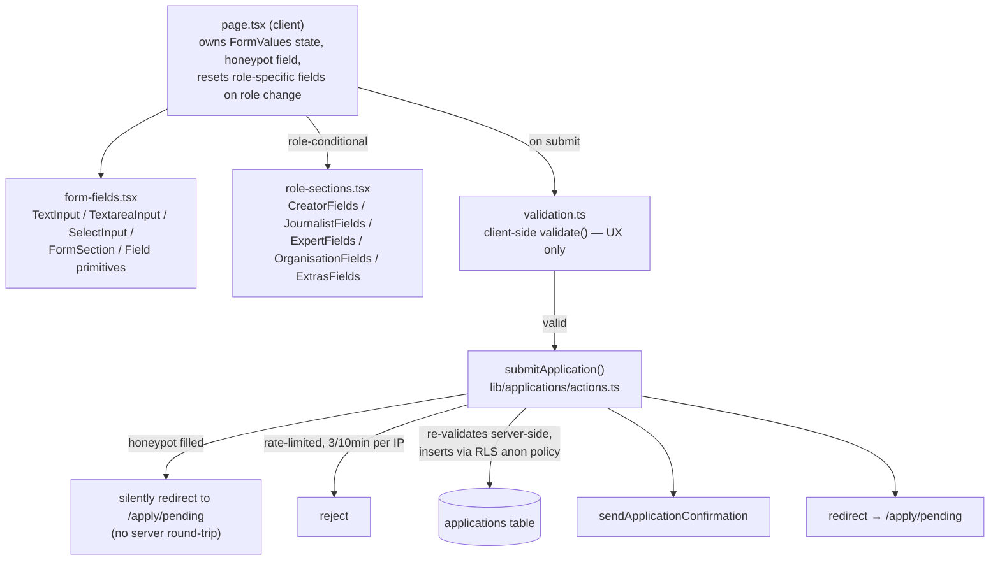

### Home / Landing / Login

- **Landing (`/`)** — `app/page.tsx`, fully static/mock content (hardcoded
  `MEMBERS`/`BRIEFS` arrays), no data fetching. Public marketing page.
- **Home (`/home`)** — `app/home/page.tsx`, server-rendered only (no client
  view file): fetches current user, 5 recent briefs, 8 recently-joined users,
  and up to 10 posts from experts/organisations, all via `lib/data/*`.
- **Login (`/login`)** — `app/login/page.tsx` → client `LoginForm`: Google
  OAuth, LinkedIn OAuth, or magic link, via `lib/auth/actions.ts`.

---

## 6. Data access layer

Pages and actions never call `supabase.from(...)` inline (aside from a few
grandfathered spots) — reads go through `lib/data/*.ts` and
`lib/directory/queries.ts`, each function taking the caller's Supabase client
so RLS is applied or bypassed depending on which client is passed in.

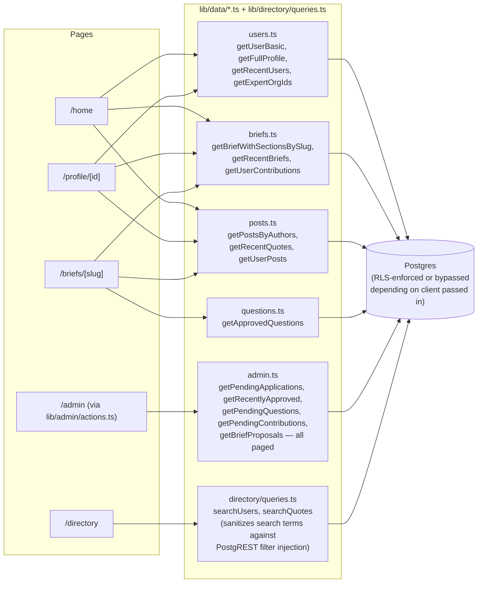

`lib/admin/actions.ts`'s exported `get*` functions are thin wrappers: call
`requireAdmin()`, then delegate to `lib/data/admin.ts` — this keeps the
Phase-1 security invariant (every admin *action* — the public entry point —
enforces auth) while still centralizing the actual queries.

---

## 7. Server actions map

All mutations go through `'use server'` files under `lib/*/actions.ts` (plus
one page-local `app/profile/[id]/actions.ts`). Every server action is a
public HTTP endpoint regardless of what page renders the button that calls
it — this is why `requireAdmin()` and role checks happen *inside* the action,
not just in the surrounding page/component.

| File | Exports | Calls into |
| --- | --- | --- |
| `lib/auth/actions.ts` | `signInWithGoogle`, `signInWithLinkedIn`, `signInWithMagicLink`, `signOut` | Supabase Auth |
| `app/profile/[id]/actions.ts` | `updateProfile(id, form)` — self-only, strips protected fields | `users` table |
| `lib/posts/actions.ts` | `createPost`, `updatePost`, `deletePost` | `content_posts` table |
| `lib/messages/actions.ts` | `sendMessage(payload)` | `messages` table → `sendContactNotification` email |
| `lib/briefs/actions.ts` | `submitQuestion`, `submitContribution` (expert/org only), `proposeBrief` | `questions` / `brief_contributions` / `brief_proposals` → `sendBriefProposalEmail` for proposals |
| `lib/applications/actions.ts` | `submitApplication(form)` | honeypot → rate limit → server validation → `applications` table → `sendApplicationConfirmation` |
| `lib/admin/actions.ts` | `approveApplication`, `rejectApplication`, `approveQuestion`, `dismissQuestion`, `approveContribution`, `dismissContribution`, `dismissBriefProposal`, + paged `get*` reads | `requireAdmin()` first, then `users`/`applications`/`questions`/`brief_contributions`/`brief_proposals`, plus approval/rejection emails |
| `lib/admin/brief-actions.ts` | `createBrief`, `getBrief`, `saveBrief`, `deleteBrief` | `requireAdmin()` first, then `briefs`/`brief_sections` |

### Admin approve-application flow (highest-stakes action)

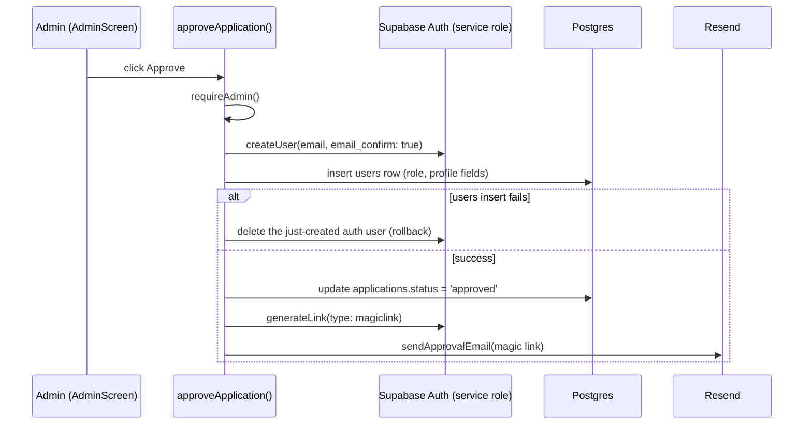

---

## 8. Security model

Established during the Phase 1 hardening pass and enforced by convention
since (see `CONTRIBUTING.md`'s Security conventions section for the
always-current list):

1. **`requireAdmin()` first, always.** Every export in `lib/admin/actions.ts`
   and `lib/admin/brief-actions.ts` calls it as the first line — page-level
   checks (`ADMIN_EMAIL` comparison in `app/admin/page.tsx`) protect only the
   rendered UI, not the action itself.
2. **`'use server'` vs `server-only`.** Email templates (`lib/email/*`) and
   the service-role client (`lib/supabase/admin.ts`) are `import 'server-only'`
   — never `'use server'`, which would turn them into public callable
   endpoints (e.g. an open email-relay).
3. **RLS decides visibility, not the UI.** The brief page always queries with
   the RLS client; a logged-out visitor's `showSections` check in
   `BriefView.tsx` is presentation-only — the database has already withheld
   section content for members-only briefs regardless of what the client
   renders (verified at the HTTP-response level in `tests/security.spec.ts`).
4. **Search input sanitization.** `lib/directory/queries.ts`'s
   `sanitizeSearchTerm()` strips characters (`, ( ) " ' \`) that could alter
   a PostgREST `.or()` filter's structure before interpolating user input.
5. **Application submission hardening**
   (`lib/applications/actions.ts::submitApplication`): honeypot field,
   in-memory per-IP rate limit (3 / 10 min, best-effort — resets on
   redeploy), server-side re-validation independent of the client, and a
   duplicate-pending-email check.

---

## 9. Database schema

```mermaid
erDiagram
    users ||--o{ content_posts : authors
    users ||--o{ messages : sends
    users ||--o{ messages : receives
    users ||--o{ questions : asks
    users ||--o{ brief_contributions : contributes
    users ||--o{ brief_proposals : proposes
    users ||--o{ user_affiliations : "is affiliated via"
    users ||--o{ user_affiliations : "is org for"

    briefs ||--o{ brief_sections : has
    briefs ||--o{ questions : "asked on"
    briefs ||--o{ brief_contributions : "contributed to"

    users {
        uuid id PK "FK to auth.users"
        string email
        enum role "creator|expert|organisation|journalist|admin"
        string display_name
        jsonb role_specific_fields "nullable, role-dependent"
    }
    briefs {
        uuid id PK
        string title
        string slug
        string tldr
        enum visibility "public|members"
    }
    brief_sections {
        uuid id PK
        uuid brief_id FK
        enum section_type
        text content
        int display_order
    }
    content_posts {
        uuid id PK
        uuid user_id FK
        enum post_type "video|article|paper|quote|resource"
        string title
        text body
    }
    applications {
        uuid id PK
        enum status "pending|approved|rejected"
        enum desired_role
        string email
    }
    questions {
        uuid id PK
        uuid brief_id FK
        uuid user_id FK
        enum status "pending|approved"
        text question_text
        text answer_text
    }
    brief_contributions {
        uuid id PK
        uuid brief_id FK
        uuid user_id FK
        enum status "pending|approved|dismissed"
        text contribution_text
    }
    brief_proposals {
        uuid id PK
        uuid user_id FK "nullable, on delete set null"
        enum status "pending|dismissed"
        string title
    }
    messages {
        uuid id PK
        uuid sender_id FK
        uuid recipient_id FK
        enum status
        string subject
    }
    user_affiliations {
        uuid user_id FK
        uuid organisation_id FK
    }
    translations {
        string entity_type "polymorphic, no FK"
        uuid entity_id
    }
```

Notes:
- `applications` has no FK to `users` — an approved application becomes a
  *new* `users` row via the approve flow (§7), the two tables aren't linked.
- `translations` exists but is unused in v1 (reserved for multilingual, v2).
- `user_affiliations` links a user to an organisation user, but no app code
  reads/writes it yet as of this snapshot.
- RLS is enabled on every table; policies are additive per feature (see
  migration numbers 003, 008, 009, 013, 015 for the read/write policy
  changes — table creation vs. policy migrations are interleaved).
- Full migration history: `supabase/001` through `supabase/016` — numbered
  SQL files run manually in the Supabase SQL Editor (no automated runner).
  Generated types (`lib/database.types.ts`) must be regenerated after every
  migration via `bunx supabase gen types typescript --project-id <ref> --schema public > lib/database.types.ts`.

---

## 10. Shared UI primitives

`components/ui/` — used across directory, home, profile, briefs, and admin:

| Component | Key props |
| --- | --- |
| `Avatar.tsx` | `size` (`xs`→`3xl`), `palette` (`gray`\|`colored`), `avatarUrl` (falls back to initial), `ringClassName` |
| `RoleBadge.tsx` | `role`, `variant` (`pill`\|`outline`), `size` (`xs`\|`sm`\|`md`) |
| `Pagination.tsx` | `page`, `pageSize`, `total`, `buildHref(page)`, `dark` — renders nothing if only one page |

`lib/types.ts` is the single source of truth for shared enums (`UserRole`,
`PostType`, `BriefVisibility`, etc.), all derived from the generated
`lib/database.types.ts` rather than hand-declared — regenerate types, and
the enum types follow automatically.

---

## 11. Testing

Playwright specs in `tests/`, run via `bun run test`:

| Spec | Covers |
| --- | --- |
| `smoke.spec.ts` | Landing page renders without JS errors, nav/CTAs present, mobile layout |
| `auth.spec.ts` | Route protection redirects, `/login` rendering, public routes stay accessible logged out |
| `application.spec.ts` | `/apply` field rendering, role-conditional fields, validation, full submission |
| `briefs.spec.ts` | Public vs members-only rendering for a logged-out visitor |
| `contact.spec.ts` | Contact modal flow between an authenticated creator and an expert profile |
| `security.spec.ts` | Raw-HTTP-response checks that members-only content is actually withheld server-side (not just CSS-hidden), admin route redirects, rate limiting |

`tests/global-setup.ts` authenticates two fixture users (`creator`, `expert`)
before the suite runs by generating a magic link via the Supabase admin API,
exchanging it server-side, and hand-constructing the `sb-<project>-auth-token`
cookie `@supabase/ssr` expects — then persists `storageState` to
`playwright/.auth/{creator,expert}.json` for reuse across specs. There is no
equivalent admin fixture yet — admin-only flows (`/admin`, `/admin/briefs/[id]`)
have no interactive test coverage as of this snapshot.

CI (`.github/workflows/ci.yml`) runs lint, `tsc --noEmit`, build, and the
full Playwright suite against the live Supabase project on every PR and push
to `master`.

---

## 12. Known gaps / follow-up items

Carried over from the pt.5 review pass, still open as of this snapshot:

- `Avatar.tsx`: `name.charCodeAt(0)` is `NaN` on an empty name, producing a
  broken `className` on the fallback avatar.
- `DirectoryView.tsx`: displayed page number uses `parseInt(...) || 1`;
  a manually-crafted negative `?qpage=` value displays "Page -N of M"
  (cosmetic only — the actual fetch is clamped server-side).
- `PagedResult<T>` is declared identically in both
  `lib/directory/queries.ts` and `lib/data/admin.ts` — not yet unified.
- `getFullProfile` in `lib/data/users.ts` types its return as the full
  `UserRow` but the select omits `updated_at` — harmless today (no reader
  uses it), but the type is a lie.
- No dedicated test coverage for directory/admin pagination behavior, or for
  any admin-only interactive flow (no admin Playwright fixture exists yet).
- `app/profile/[id]/page.tsx` still serves hardcoded `MOCK_PROFILES`
  (`mock-expert`, `mock-creator`) instead of querying the DB for those IDs —
  a design-preview leftover, not wired behind a flag.
- `EditProfileModal.tsx` (517 lines) is over the repo's 500-line lint
  threshold but wasn't caught by the original max-lines pass — worth
  splitting next time it's touched.
- Duplicate type declarations not yet migrated onto `lib/types.ts`:
  `Application` interface in `lib/admin/actions.ts`, types in
  `lib/messages/actions.ts`.
- CI hardening ideas: some secrets are job-scoped rather than step-scoped;
  the build step builds for production but the E2E job runs the dev server;
  the concurrency group cancels in-flight `master` push runs.

Planned next (per the refactoring roadmap): Phase 3 (cache public briefs,
hide member emails via column grants, tsvector search) and Phase 4 (GDPR
toolkit, Sentry).
