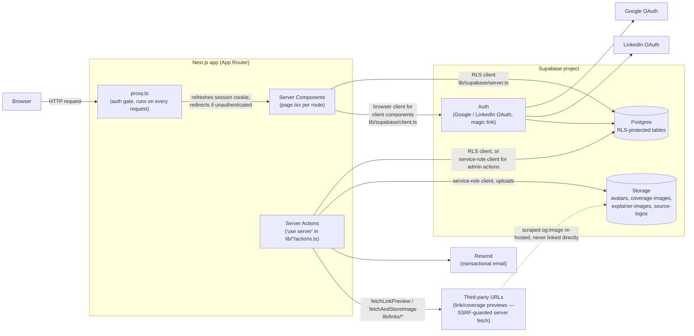
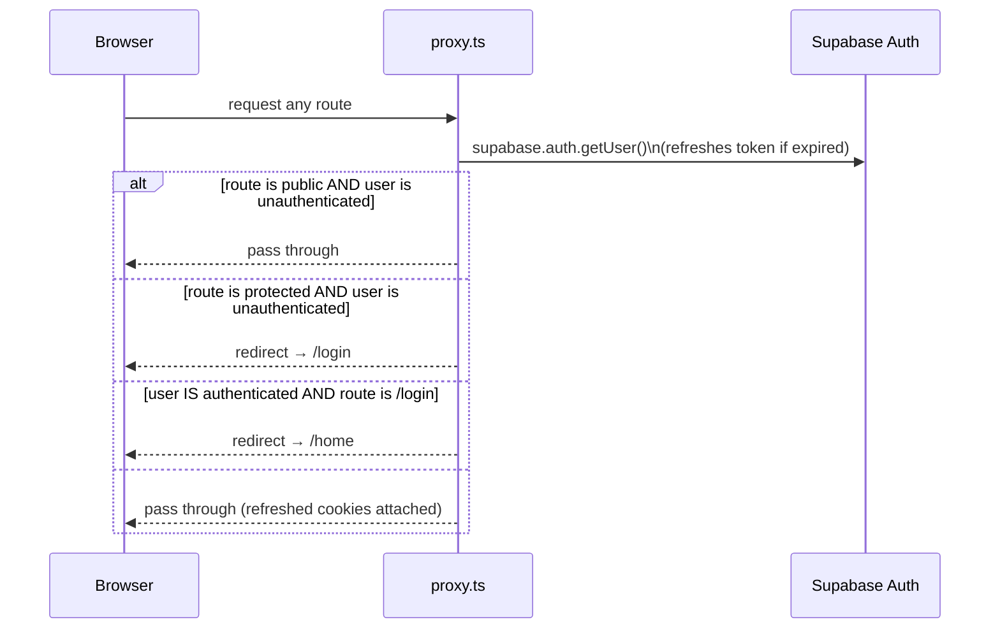
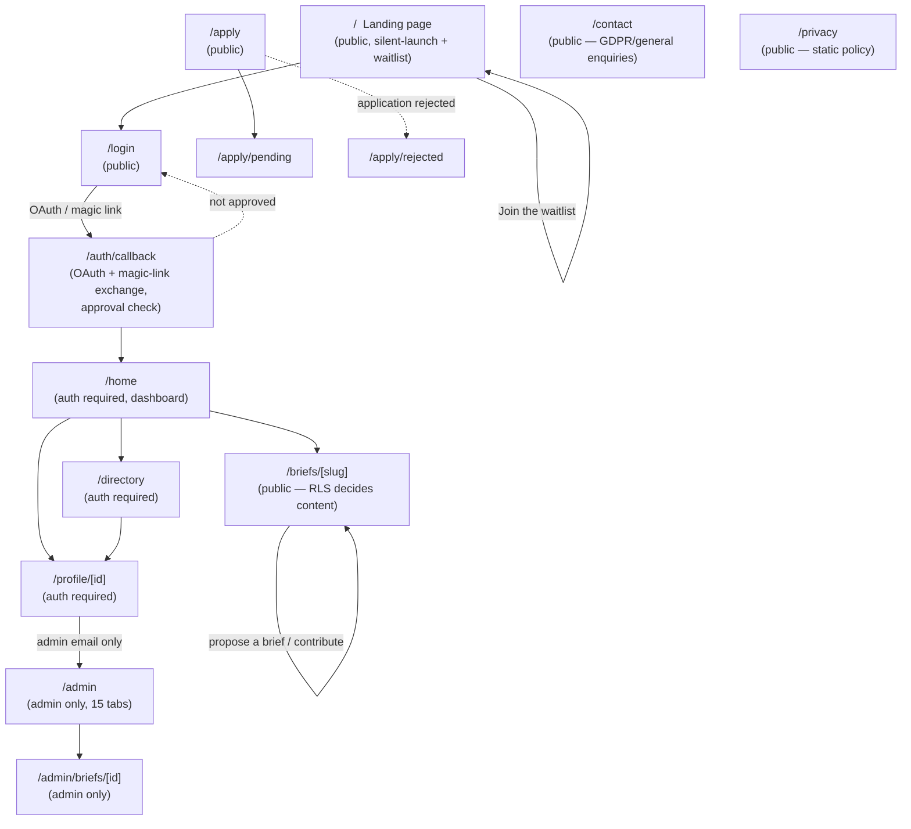
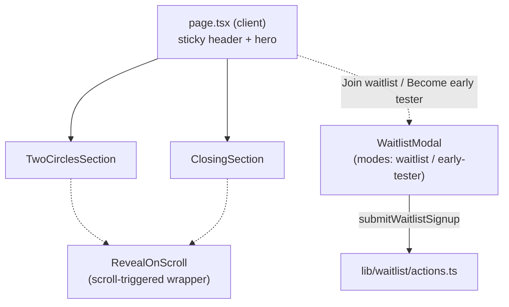
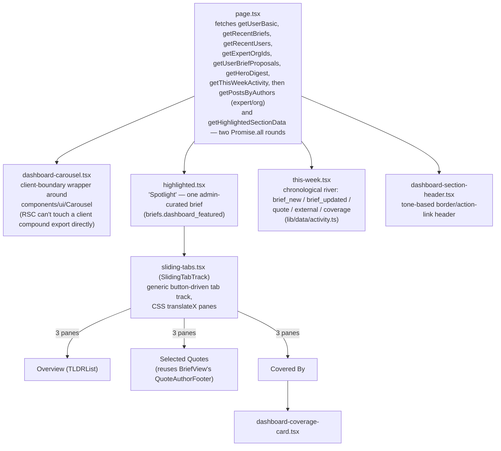
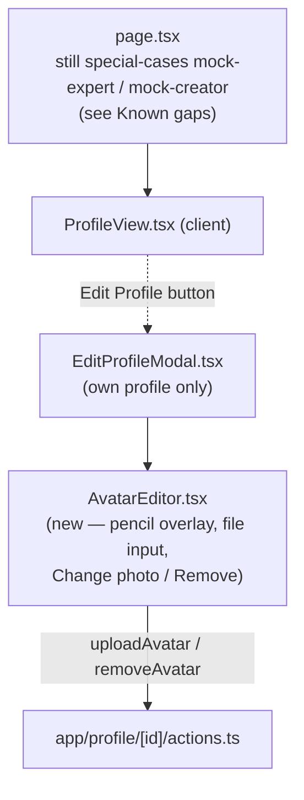
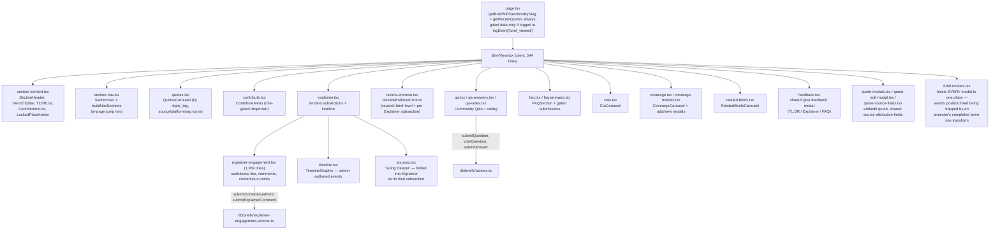
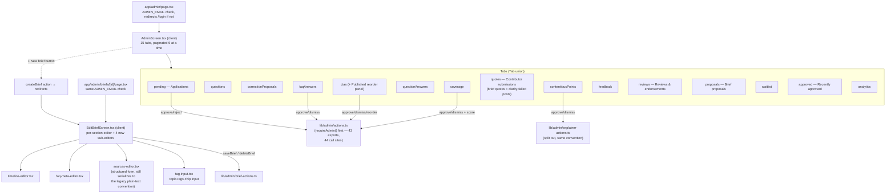
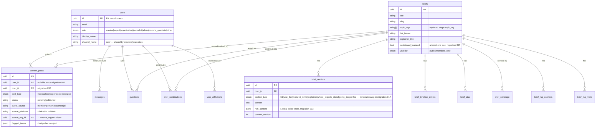

# Tell The World — Architecture Snapshot

**Date:** 2026-09-17
**Written after:** roughly five weeks of feature work landed on `master` since the
[2026-08-10](2026-08-10.md) snapshot — the Brief feature "Two-Ink Bold" rebuild
(Explainer engagement, Coverage, Timeline, FAQ meta, Q&A voting, quote source
icons, Lexical rich text), a full Home dashboard rebuild, a silent-launch
Landing page + Waitlist flow, a deterministic clarity-check content gate,
an analytics-events log, avatar uploads, a `/contact` + `/privacy` page pair,
and two new user roles (`comms_specialist`, `other`). 45 new numbered
migrations (017–061) landed in that window. See [README.md](README.md) for
how this snapshot fits into the doc history, and the previous snapshot for
what the app looked like before this pass.

This is a structural reference for developers joining the project: how a
request flows through the app, how pages/components/data connect, and how
the pieces are supposed to talk to each other. It is not a tutorial — for
setup and day-to-day conventions see [`CONTRIBUTING.md`](../../CONTRIBUTING.md).

---

## 1. Tech stack

- **Next.js 16.1.6** (App Router), **React 19.2.3**, **TypeScript** (`strict: true`),
  **Tailwind CSS 4** (`@theme` CSS-token syntax, no JS config file)
- **Supabase**: Postgres + Auth (Google/LinkedIn OAuth + magic link, no
  passwords) + Row Level Security + **Storage** (4 buckets — new since the
  last snapshot, see §9)
- **Resend** for transactional email
- **Lexical** (`lexical`, `@lexical/react`, `@lexical/rich-text`, `@lexical/link`,
  `@lexical/selection`) for the brief Explainer/FAQ rich-text editor —
  **this replaced TipTap** since the last snapshot (`lib/richtext/editor.tsx`,
  `lib/richtext/render.tsx`). If you have older context that says TipTap,
  it's stale.
- **Playwright** for end-to-end tests (E2E only — no unit test runner)
- **Bun** for package management/scripts (not npm/npx/node — see repo
  `CLAUDE.md`)
- Middleware lives in `proxy.ts` at the repo root — the Next.js 16 name for
  what used to be `middleware.ts`.
- No client-side state library (Redux/Zustand/etc.) anywhere in the repo —
  React built-ins only (`useState`/`useEffect`, one `createContext` scoped to
  `components/ui/Carousel.tsx`), consistent with "client components by
  default" and server-fetched data passed down as props.

**Scale, for orientation:** 13 page routes + 1 route handler, ~103
non-page/layout `.tsx` files, 36 database tables, 63 numbered SQL migration
files, ~79,700 lines of `.ts`/`.tsx` (includes the 1,901-line generated
`database.types.ts`).

---

## 2. System context

**Three Supabase clients**, unchanged in shape from the last snapshot
(`lib/supabase/`):

| Client | File | Where used | RLS |
| --- | --- | --- | --- |
| Browser | `client.ts` | Client components (`'use client'`) | Enforced |
| Server (RSC) | `server.ts` | Server Components, Server Actions, `proxy.ts` — cookie-based session | Enforced |
| Admin | `admin.ts` | Admin server actions, analytics logging, storage uploads that need to bypass a user's own RLS scope | **Bypassed** |

**New: re-hosting external images instead of linking them directly.**
`lib/links/link-preview.ts` (scrapes OG/meta tags for coverage submissions,
SSRF-guarded via `isPrivateHost()`, 5s timeout, 1MB cap, never throws) and
`lib/links/store-image.ts` (re-uploads the scraped image into the
`coverage-images` bucket rather than storing the third-party URL) exist
specifically because the app's CSP `img-src` only allow-lists `'self'`,
`data:`, and the Supabase storage origin — the same pattern avatar uploads
already used. This is a real architectural constraint, not an arbitrary
choice: any future feature that wants to display a scraped external image
must re-host it the same way.

---

## 3. Request lifecycle — `proxy.ts`

Every request (except `_next/static`, `_next/image`, and static assets) runs
through `proxy.ts` before reaching a page. The core two-branch gate is
unchanged from the last snapshot:

Current `PUBLIC_ROUTES` (`proxy.ts:5-13`): `/`, `/login`, `/apply`,
`/apply/pending`, `/apply/rejected`, `/privacy`, `/contact` — **`/privacy`
and `/contact` are new** since the last snapshot. Plus prefix matches:
anything under `/auth/*` (OAuth callback) and anything under `/briefs/*`
(public brief pages — the page itself decides what content a logged-out
visitor sees, via RLS, not the proxy). This remains a **coarse gate only** —
logged in or not, nothing role-specific. `proxy.ts` itself has no other
logic changes.

**New: the OAuth approval gap is closed.** The old snapshot's model assumed
magic link's `shouldCreateUser: false` was the only approval gate — but
Google/LinkedIn OAuth always creates/logs into a Supabase Auth identity
regardless of app approval, which was a real gap. `lib/auth/approval.ts`
now provides `isApprovedMember(supabase, email)` (framework-agnostic, no
`'use server'`/`server-only` marker, callable from a plain service-role
client so it's directly testable — see `tests/auth-approval.spec.ts`),
called from `app/auth/callback/route.ts` right after code exchange. An
unapproved OAuth login now redirects to `/login?error=not_approved`, which
`/login` renders as a gated message ("you're not on the list yet") in place
of the sign-in buttons, with a "Try a different account" link to reveal
them again — part of the silent-launch posture (see §5, Landing page).

---

## 4. Route map

| Route | Auth | Server component | Client view |
| --- | --- | --- | --- |
| `/` | public | `app/page.tsx` (**client component**, not server) | inline — silent-launch hero + `components/landing/*` |
| `/login` | public | `app/login/page.tsx` | inline `LoginForm`, renders `not_approved` gated state |
| `/apply` | public | `app/apply/page.tsx` (client) | inline, uses `form-fields.tsx` + `role-sections.tsx` (now 6 roles incl. Comms Specialist/Other) |
| `/apply/pending`, `/apply/rejected` | public | static pages | — |
| `/auth/callback` | public | `app/auth/callback/route.ts` (route handler) | — |
| `/contact` | public | `app/contact/page.tsx` (**client**) | inline form — no DB table, relays to admin inbox |
| `/privacy` | public | `app/privacy/page.tsx` (server, static) | — |
| `/home` | required | `app/home/page.tsx` — **note:** unlike every other screen, this server component renders most markup directly rather than handing off to a single `HomeView.tsx`; only specific sections delegate to client children | `dashboard-carousel.tsx`, `highlighted.tsx`, `this-week.tsx` |
| `/directory` | required | `app/directory/page.tsx` | `DirectoryView.tsx` (unchanged) |
| `/profile/[id]` | required | `app/profile/[id]/page.tsx` | `ProfileView.tsx` + `AvatarEditor.tsx` |
| `/briefs/[slug]` | public, RLS-scoped | `app/briefs/[slug]/page.tsx` | `BriefView.tsx` (massively expanded, see §5) |
| `/admin` | admin email only | `app/admin/page.tsx` | `AdminScreen.tsx` (15 tabs) |
| `/admin/briefs/[id]` | admin email only | `app/admin/briefs/[id]/page.tsx` | `EditBriefScreen.tsx` (4 new sub-editors) |

**Convention** (per `CONTRIBUTING.md`): each screen is a `page.tsx` server
component (auth check + data fetch) handing off to a client `*View.tsx`
component. **`/home` is the one exception to this pattern** — worth knowing
before assuming every route follows it.

**Known gap, newly identified: no `/briefs` list route exists.**
`app/briefs/[slug]/` exists but there is no `app/briefs/page.tsx`. Three
places link to `/briefs` — `BriefView.tsx`'s nav, `ProfileView.tsx`'s nav,
and `app/home/page.tsx`'s "View all →" / header nav — and all three
currently 404. This is a real, current gap, not documentation staleness.

---

## 5. Page-by-page component trees

### Landing page (`/`)

Reworked from the old static/mock marketing page into a **silent-launch**
page (per `docs/design/landing-page/plans/temp-landing-page-plan.md`, 2026-08-23):
sticky header (Logo, Apply, Sign in) → hero ("Opening soon" eyebrow, 3-line
headline, "Join the waitlist" CTA) → `components/landing/TwoCirclesSection`
→ `components/landing/ClosingSection` (`onJoinWaitlist` /
`onBecomeEarlyTester` callbacks) → `Footer` → conditionally
`components/landing/WaitlistModal`. `components/landing/RevealOnScroll.tsx`
wraps both sections for a scroll-triggered reveal.

The **old landing page** (briefs teaser grid, trust strip, full apply flow)
still exists as `components/landing/LegacyLandingPage.tsx` but is **not
routed anywhere** — deliberately kept for reuse once a permanent landing
page replaces the silent-launch one. `/apply` and `/briefs/[slug]` still
work; they're just no longer linked from `/`.

**Note:** the current branch (`feature/conference-landing-page-part0`) has
added a *planning* doc for a further landing-page direction
(`docs/design/landing-page/plans/conference-landing-page-plan.md` +
`qa-feature-loop-concept.html`) — not yet built, docs-only as of this
snapshot.

`WaitlistModal` has two modes — `waitlist` (straight to form) and
`early-tester` (intro step + `wants_early_access` checkbox, defaulted on) —
both submit through the same `submitWaitlistSignup` server action, which
mirrors `submitApplication`'s hardening pattern: honeypot, in-memory per-IP
rate limit (3/10 min), full server-side validation (role enum now includes
`comms_specialist`/`other`, URL scheme-normalization, creator-role requires
platform+link), insert into `waitlist_signups` (unique on `lower(email)`),
then fire-and-forget `sendWaitlistNotificationEmail` to admin + awaited
`sendWaitlistConfirmation` to the signee (an email failure doesn't fail the
already-recorded signup).

### Home dashboard (`/home`)

Went from a plain server-rendered summary page to a full dashboard, while
keeping most rendering in the server component itself (see the routing note
above):

`highlighted.tsx` exports both the data loader (`getHighlightedSectionData`)
and the component in one file — needs `getFeaturedBrief`/
`getFeaturedBriefDetail`, `getEndorsementBar`, `getQuotesForBrief`,
`getPublishedCoverage`. `getHeroDigest` (`lib/data/home.ts`) builds a
personalized 7-day "welcome back" blurb from the user's own contributions,
questions, and proposals as an engagement proxy — there's no follow/bookmark
table. `getThisWeekActivity` explicitly does **not** read `analytics_events`
(rejected in the source comment as "a service-role-only behavior log, not a
content-publish log").

### Directory (`/directory`)

Unchanged from the last snapshot — `DirectoryView.tsx` still owns filter
state and both page numbers (`upage`/`qpage`) in the URL.

### Profile (`/profile/[id]`)

`AvatarEditor` is used inside `EditProfileModal`, not directly by
`ProfileView` — confirmed wired in, not orphaned. Both actions go through
`useTransition`, call a parent `onAvatarChange` callback, then
`router.refresh()`. Backs the `avatars` storage bucket (migration 054):
5MB cap, jpeg/png/webp/gif allow-list.

**Known gap, still open:** `app/profile/[id]/page.tsx` still special-cases
`mock-expert`/`mock-creator` against hardcoded `MOCK_PROFILES`/`MOCK_POSTS`
instead of querying the DB for those IDs — the same Phase 2 cleanup item
flagged in the last snapshot, unresolved.

### Brief page (`/briefs/[slug]`)

The single biggest area of growth. `BriefView.tsx` (544 lines, over the
500-line lint threshold — see §12) takes a 17-prop `BriefViewProps` and now
composes:

**Major new sub-features:**

- **Explainer Engagement** (`explainer-engagement.tsx`) — three mechanisms:
  (1) a plain "usefulness" like for creator/journalist/admin roles; (2)
  comments open to any logged-in member, immediate-publish, likeable and
  repliable one level deep; (3) contentious-point flags (expert/org/admin),
  moderated by admin approve/dismiss, likeable and repliable. Admin is
  deliberately included in the contributor gate purely so admin can preview
  flows without a second test account.
- **Coverage with comments** — press coverage submissions get a numeric
  relevance score set by admin at approval, plus threaded up/down-voted
  comments.
- **Timeline events** — admin-authored (`brief_timeline_events`), rendered
  as a vertical dot/rule graphic inside the Explainer; ordering is a manual
  `display_order`, independent of the event date.
- **FAQ with meta** — `faq-meta-editor.tsx` (admin) attaches
  collaborator/feedback-giver bylines and an optional rich-text override per
  parsed FAQ question, keyed by exact question text (renaming a question
  detaches its meta row — an accepted fragility, called out in-file).
- **Q&A with voting** — community questions with expert answers; vote
  color-coding is role-based (blue = expert/org, pink = creator/journalist).
- **Quote source icons** — quotes can be attributed to `member | person |
  document | ai`; person-sourced quotes get an X/LinkedIn platform icon;
  document/AI-sourced quotes can reference a reusable `source_organizations`
  row with an uploaded logo (migration 060, seeded with an OpenAI entry).
- **Review/endorse** — the same `ReviewEndorseControl` is reused at both
  brief level and per-Explainer-subsection.
- **Rich text via Lexical** — `brief_sections.rich_content` and
  `brief_faq_answers.rich_content` (`jsonb`) store a Lexical editor-state
  subset alongside the legacy plain-text `content` column;
  `lib/richtext/types.ts` defensively parses/validates it (falls back to
  plain text on any malformed shape) and can one-way-convert legacy
  plain-text sections to rich text from the admin editor.
- **`brief-modals.tsx`** hoisting every top-level modal to one place is a
  deliberate CSS fix, not incidental organization — worth knowing if you add
  a new modal here.

Admin gets a subtle "Edit this brief →" link in the hero eyebrow row,
linking to `/admin/briefs/[id]`.

### Admin (`/admin`, `/admin/briefs/[id]`)

`AdminScreen.tsx`'s tab set grew from 5 to **15** (paginated 6-at-a-time via
a `‹ ›` control since they no longer fit one row):

New card components (`app/admin/`): `analytics-tab.tsx` (read-only
`AnalyticsEventRowItem` feed), `waitlist-card.tsx` (read-only + "Early
tester" badge), `coverage-card.tsx` (approve/dismiss + optional score),
`cta-card.tsx` (+ `PublishedCtaCard` for manual reorder), `feedback-card.tsx`
(single "mark reviewed" action — nothing here publishes), `contentious-
point-card.tsx`, `faq-answer-card.tsx`, `question-answer-card.tsx`,
`review-card.tsx` (read-only; reviews/endorsements publish immediately, only
action is admin soft-remove), `content-post-card.tsx` (approve/dismiss any
flagged `content_posts` row — quote or profile post — showing its
`FlaggedTerm[]` from the clarity check).

`EditBriefScreen.tsx` now also edits `explainerTitle`, `tldrTeaser`,
`pinnedMediaPostId`, `visibility`, and a new **`dashboardFeatured`**
boolean that drives Home's Highlighted section (migration 057 enforces
at-most-one-featured via a partial unique index; `saveBrief` clears any
other featured brief when one is turned on).

**Note on the auth gate**: unchanged — still a single hardcoded
`ADMIN_EMAIL` string-equality check at the page level, backed by
`requireAdmin()` inside every action. See §8.

### Apply (`/apply`)

Same structure as the last snapshot (`form-fields.tsx` + `role-sections.tsx`
+ `validation.ts` → `submitApplication`), now covering **6 roles** instead
of 4 (Comms Specialist and Other added via migration 056, tested in
`tests/application.spec.ts`).

### Contact (`/contact`) — new

Client component: name/email/topic/message form, honeypot, client-side
validation, submits via `submitContactForm` (`lib/contact/actions.ts`).
**No DB table** — it relays straight to an admin-inbox email
(`sendContactFormEmail`), with its own honeypot + rate limit (5/10min).
This is a distinct flow from the existing `ContactModal` (profile-to-profile
"contact this expert" button), which still writes to the `messages` table
via `lib/messages/actions.ts::sendMessage`. Don't confuse the two.

### Privacy (`/privacy`) — new

Static server component with a `Metadata` export: full GDPR privacy policy,
12 numbered sections (controller, data collected, legal basis, sharing,
international transfers, retention, rights, cookies, security, children,
changes, contact). Last-updated date is a hardcoded string, not derived from
anything — remember to update it by hand if the policy changes.

### Login (`/login`)

Same three sign-in methods as before, now also renders the `not_approved`
gated state (see §3) when an OAuth login succeeds but the email isn't on the
approved list.

---

## 6. Data access layer

Still the core convention: pages and actions call into `lib/data/*.ts` +
`lib/directory/queries.ts`, each function taking the caller's Supabase
client so RLS is applied or bypassed depending on which client is passed.
Substantially more files now exist, grouped by feature area:

```mermaid
flowchart LR
    subgraph DataLayer["lib/data/*.ts + lib/directory/queries.ts"]
        Users["users.ts"]
        Briefs["briefs.ts\n+ getFeaturedBrief(Detail),\ngetBriefContributors"]
        Posts["posts.ts\n+ quote_source / source_organizations,\nlikeCount/myLike aggregation"]
        Contrib["contributions.ts\ngetEndorsementBar, getMaxContentVersion"]
        Coverage["coverage.ts\ncomments + up/down vote tallies"]
        Ctas["ctas.ts"]
        Explainer["explainer-engagement.ts\ncomments, contentious points, usefulness"]
        FaqA["faq-answers.ts"]
        FaqM["faq-meta.ts"]
        Home["home.ts\ngetHeroDigest"]
        Activity["activity.ts\ngetThisWeekActivity"]
        Questions["questions.ts"]
        QAnswers["question-answers.ts"]
        AdminData["admin.ts\npaged reads for every\nmoderation queue"]
        DirQ["directory/queries.ts\nsanitizeSearchTerm unchanged"]
    end

    DB[("Postgres\n(RLS-enforced or bypassed\ndepending on client passed in)")]
    DataLayer --> DB
```

`lib/data/admin.ts`'s header comment explicitly notes it does **no** auth of
its own — callers in `lib/admin/actions.ts` must call `requireAdmin()`
first, same invariant as the last snapshot.

---

## 7. Server actions map

All mutations go through `'use server'` files. Grep-verified: **zero**
`'use server'` files export a non-function `const` — the shared
`CONTRIBUTOR_ROLES` array constant deliberately lives in `lib/types.ts`
(not a `'use server'` file) specifically to avoid the value-export crash
this project has hit before.

| File | Exports | Calls into |
| --- | --- | --- |
| `lib/auth/actions.ts` | `signInWithGoogle`, `signInWithLinkedIn`, `signInWithMagicLink`, `signOut` | Supabase Auth |
| `app/profile/[id]/actions.ts` | `updateProfile`, `uploadAvatar`, `removeAvatar` | `users` table, `avatars` storage bucket |
| `lib/posts/actions.ts` | `createPost` (clarity-gated for expert/org), `updatePost`, `deletePost` | `content_posts` |
| `lib/messages/actions.ts` | `sendMessage` | `messages` → `sendContactNotification` |
| `lib/contact/actions.ts` **(new)** | `submitContactForm` | no table — relays to `sendContactFormEmail` |
| `lib/briefs/actions.ts` (21 exports) | `submitCorrectionProposal`, `submitQuestion`, `submitFaqAnswer`, `submitCta`, `submitCoverage`, `submitQuote`/`updateOwnQuote` (clarity-gated), `likeQuote`, `logQuoteUsage`, `likeCoverage`, `submitCoverageComment`, `voteCoverageComment`, `getCoverageDetail`, `voteQuestion`, `voteAnswer`, `submitAnswer`, `endorseAnswer`, `getVoters`, `submitBriefFeedback`, `proposeBrief`, `setReviewStatus`, `withdrawReview` | `questions`/`brief_ctas`/`brief_coverage`/`content_posts`/`question_answers`/`brief_feedback`/`brief_proposals`/`brief_contributions` + `lib/links/*` for coverage |
| `lib/briefs/explainer-engagement-actions.ts` **(new)** | `submitContentiousPoint(Like)`, `submitExplainerComment(Like)`, `submitExplainerUsefulVote`, `getExplainerUsefulLikers` | `explainer_*` tables, `logEvent()` |
| `lib/waitlist/actions.ts` **(new)** | `submitWaitlistSignup` | `waitlist_signups` → confirmation + notification emails |
| `lib/applications/actions.ts` | `submitApplication(form)` | honeypot → rate limit → server validation → `applications` → `sendApplicationConfirmation` + `sendApplicationNotification` |
| `lib/admin/actions.ts` | 43 exports (applications, questions, correction proposals, FAQ answers, CTAs, content posts, coverage, brief feedback, waitlist reads, brief reviews, brief proposals) | `requireAdmin()` first (44 call sites), then the relevant tables + emails |
| `lib/admin/brief-actions.ts` | `createBrief`, `getBrief`, `getUserOptions`, `getBriefOptions`, `getMediaPickerOptions`, `saveBrief`, `uploadExplainerImage`, `deleteBrief` | `requireAdmin()` first, then `briefs`/`brief_sections`, `explainer-images` bucket |
| `lib/admin/explainer-actions.ts` **(new)** | `getPendingContentiousPoints`, `approveContentiousPoint`, `dismissContentiousPoint` | `requireAdmin()` first — split out of `lib/admin/actions.ts` for line-budget reasons |

### Admin approve-application flow (highest-stakes action, unchanged)

Same as the last snapshot: `requireAdmin()` → `createUser(email_confirm:
true)` → insert `users` row (rollback the auth user on failure) →
`applications.status = 'approved'` → `generateLink(magiclink)` →
`sendApprovalEmail`.

---

## 8. Security model

Established during Phase 1 hardening and still enforced by convention,
with two additions since the last snapshot:

1. **`requireAdmin()` first, always.** Every export in `lib/admin/actions.ts`
   (43), `lib/admin/brief-actions.ts` (8), and the new
   `lib/admin/explainer-actions.ts` (3) calls it as the first line — 44
   total call sites, confirmed 1:1 against export counts. Page-level checks
   (`ADMIN_EMAIL` comparison) protect only the rendered UI.
2. **`'use server'` vs `server-only`, still intact.** All `lib/email/*.ts`
   files except `resend.ts` (a marker-less low-level client instantiation,
   safe since it's only imported by the `server-only` `send.ts`) are
   `server-only`. Same for `lib/analytics/log.ts` and `lib/links/*.ts`.
   `lib/clarity/check.ts`/`glossary.ts` are intentionally marker-less pure
   functions, callable from both server actions and the client-side
   `useClarityGate` hook.
3. **RLS decides visibility, not the UI** — unchanged principle, verified at
   the HTTP-response level in `tests/security.spec.ts`.
4. **Search input sanitization** — `sanitizeSearchTerm()` in
   `lib/directory/queries.ts`, unchanged.
5. **Application/waitlist/contact submission hardening** — all three
   (`lib/applications/actions.ts`, `lib/waitlist/actions.ts`,
   `lib/contact/actions.ts`) independently implement the same pattern:
   honeypot field, in-memory per-IP rate limit, server-side re-validation.
   Each is its own in-memory limiter — **not shared across instances**, a
   known, self-acknowledged limitation (see §12).
6. **New: `isApprovedMember()` closes the OAuth approval gap** (see §3) —
   OAuth logins are now checked against the same approved-member list magic
   link already enforced.
7. **New: deterministic clarity-check content gate.** `lib/clarity/check.ts`
   runs a glossary-based jargon match (no readability scoring — considered
   and dropped for v1) against expert/organisation submissions
   (`CONTRIBUTOR_ROLES` in `lib/types.ts`) in both `createPost` and
   `submitQuote`/`updateOwnQuote`. A flagged submission is inserted as
   `status: 'pending'` with `flagged_terms` populated instead of publishing
   immediately, feeding the admin `content_post_card.tsx` moderation queue
   — this is a genuinely new moderation gate, not present in the last
   snapshot.
8. **New: SSRF-guarded external fetch.** `lib/links/link-preview.ts`'s
   `isPrivateHost()` blocks localhost/loopback/link-local/private IP
   ranges before scraping a coverage-submission URL — noted in its own
   comment as **not exhaustive** (no DNS-rebinding protection). Worth a
   security-review pass if this fetch surface grows.
9. **New: `analytics_events` is default-deny.** RLS is enabled with **zero**
   policies — the table is reachable only via the service-role client in
   `lib/analytics/log.ts`, never through a user-facing RLS path.

---

## 9. Database schema

The schema roughly **tripled** in table count since the last snapshot (11 →
36 tables) across 45 new migrations (017–061). Rather than one giant ER
diagram, here's the core diagram plus a categorized table list for the rest.

**Full current table list, grouped:**

| Area | Tables |
| --- | --- |
| Core (unchanged since last snapshot) | `users`, `user_affiliations`, `applications`, `messages`, `translations` (still unused in v1) |
| Brief core | `briefs`, `brief_sections`, `brief_proposals` |
| Brief contributions | `brief_correction_proposals` (renamed from the old `brief_contributions`), `brief_contributions` (**new table, same name reused** — polymorphic review/endorsement/take/comment), `contested_points` |
| Quotes/media | `content_posts`, `content_post_likes`, `content_usage`, `source_organizations` |
| Community Q&A | `questions`, `question_votes`, `question_answers`, `question_answer_votes`, `question_answer_endorsements` |
| FAQ | `brief_faq_answers`, `brief_faq_meta` |
| CTAs | `brief_ctas` |
| Coverage | `brief_coverage`, `brief_coverage_likes`, `brief_coverage_comments`, `brief_coverage_comment_votes` |
| Explainer engagement | `explainer_contentious_points`, `explainer_contentious_point_likes`, `explainer_comments`, `explainer_comment_likes`, `explainer_useful_votes` |
| Ops | `brief_timeline_events`, `brief_feedback`, `waitlist_signups`, `analytics_events` |

**⚠️ Naming trap:** `brief_contributions` was renamed to
`brief_correction_proposals` in migration 017, and the name
`brief_contributions` was then reused for a *different*, new polymorphic
table (review/endorsement/take/comment). Both tables exist today under
similar names with different purposes — don't confuse them when reading
older code or migrations.

**Enum changes:**
- `user_role`: `creator | expert | organisation | journalist | admin` → **+
  `comms_specialist`, `other`** (migration 056, scaffolding-only — no
  bespoke permissions/features yet, per the migration's own comment)
- `application_role`: same two additions, staggered across migrations
  004 (`other`) and 056 (`comms_specialist`)
- `brief_section_type`: **full type swap** in migration 017 (Postgres can't
  drop enum values in place, so this was a real create-new/remap/drop-old).
  Old: `recent_developments | sources_basic | sources_advanced | faq`. New:
  `tldr | use_this | featured_news | explainer | where_experts_stand |
  going_deeper | faq`.
- `post_type` and `brief_visibility`: unchanged.
- Most new status/discriminator fields are `text` + `check` constraint, not
  true Postgres enums — they read like enums but aren't (e.g.
  `content_posts.status`, `brief_ctas.status`, `brief_proposals.status`).

**New storage buckets** (all public-read, restricted writes):

| Bucket | Purpose | Write policy |
| --- | --- | --- |
| `avatars` | Profile photos, `{user_id}/avatar.{ext}` | Own folder only |
| `coverage-images` | Re-hosted `og:image` scrapes for coverage submissions | Own folder only, **no update/delete — write-once** |
| `explainer-images` | Inline images in Explainer rich text | Admin-only, via service role — no client insert policy at all |
| `source-logos` | Reusable quote-source organization logos | Admin-only, via service role |

**Migration numbering collisions (unresolved, unlike the earlier `019`
collision which was fixed by renumbering):**
- Two files both named `038_*`: `038_brief_timeline_events.sql` and
  `038_content_posts_moderation_and_likes.sql` — unrelated, no functional
  conflict.
- Two files both named `043_*`: `043_brief_ctas_display_order.sql` and
  `043_question_answers_submission.sql` — unrelated, no functional
  conflict. Both pairs were left as-is rather than renumbered.

**Notable RLS fixes** (same "anon reads need the joined table anon-readable
too" pattern as the last snapshot's TL;DR/content_posts fixes): job title
anon-read was still missing after the earlier `affiliation` grant, breaking
the reviewers-modal credential line for logged-out visitors until migration
037; `user_affiliations` had RLS enabled since day one with **no SELECT
policy at all** (a genuine original gap, not a regression) until migration
029.

Generated types (`lib/database.types.ts`) must still be regenerated after
every migration via `bunx supabase gen types typescript --project-id
kofimpjhjpgjotjanglq --schema public > lib/database.types.ts`.

---

## 10. Shared UI primitives

`components/ui/` grew substantially beyond `Avatar`/`RoleBadge`/`Pagination`:

| Component | Notes |
| --- | --- |
| `Avatar.tsx`, `RoleBadge.tsx`, `Pagination.tsx` | Unchanged in shape from the last snapshot |
| `Carousel.tsx` **(new)** | Compound component (`Carousel.Provider`/`Track`/`PrevButton`/`NextButton`) using React 19's `use()` instead of `useContext`, `ResizeObserver` + scroll-edge detection, respects `prefers-reduced-motion` |
| `CardGoLink.tsx`, `DarkBand.tsx`, `DuotonePlaceholder.tsx`, `Footer.tsx`, `Logo.tsx`, `SignOutButton.tsx`, `Thumb.tsx` **(new)** | Smaller shared presentational primitives, consumed across directory/home/profile/briefs/admin |

`components/landing/` **(new)**: `LegacyLandingPage.tsx` (unrouted, kept for
reuse), `TwoCirclesSection.tsx`, `ClosingSection.tsx`, `RevealOnScroll.tsx`,
`WaitlistModal.tsx`.

`components/ClarityFlagsPanel.tsx` **(new)** — shared between `PostModal.tsx`
and the brief page's quote-add modal (`quote-modals.tsx`), taking a
`variant` prop (`'default'` | `'ink'`) since the two surfaces use different
design languages. Purely presentational, no submit logic of its own.

`lib/types.ts` is still the single source of truth for shared enums,
derived from `lib/database.types.ts` — confirmed `UserRole` now includes
`comms_specialist`/`other`, and a new `CONTRIBUTOR_ROLES` constant lives
here (not in any action file) so multiple `'use server'` files can share it
without the value-export crash risk (see §7).

---

## 11. Testing

Playwright specs in `tests/` grew from 6 to **15**, run via `bun run test`:

| Spec | Covers |
| --- | --- |
| `smoke.spec.ts` | Landing page: no JS errors, nav, waitlist modal trigger, two-circles/closing sections, footer links, mobile layout |
| `auth.spec.ts` | Route protection, login page rendering, public routes reachable logged out |
| `auth-approval.spec.ts` **(new)** | `isApprovedMember` logic directly: admin bypass, email-casing, unknown/no email |
| `application.spec.ts` | All 6 roles incl. comms_specialist, validation, full submission |
| `briefs.spec.ts` | Public vs members-only rendering for logged-out visitors |
| `contact.spec.ts` | `ContactModal` flow (creator ↔ expert), **not** the `/contact` page |
| `ctas.spec.ts` **(new)** | CTA submission, moderation gating, published rendering |
| `faq-answers.spec.ts` **(new)** | FAQ answer submission, moderation, "More answers" toggle |
| `qa-votes.spec.ts` **(new)** | Community Q&A upvote toggle |
| `richtext-editor.spec.ts` **(new)** | Lexical editor: legacy vs. rich-text subsections, bold/link round-trip, public render |
| `home-dashboard.spec.ts` **(new)** | Highlighted module, This Week feed |
| `two-ink-bold-11f-admin.spec.ts`, `two-ink-bold-11g-remnants.spec.ts` **(new)** | Design-token regression trackers tied to the Two-Ink Bold rebrand — narrowly scoped, likely removal candidates once fully bedded in |
| `waitlist.spec.ts` **(new)** | All 6 roles, field requirements, URL normalization |
| `security.spec.ts` | Grown: TL;DR always-anon assertion, admin-session inverse case, new "sign-in gate" `not_approved` block, rate limiting (`RATE_LIMIT_E2E=1` opt-in, unchanged) |

**`tests/global-setup.ts`** is now a thin 81-line orchestrator; the actual
magic-link → cookie-injection logic moved into **`tests/helpers/auth.ts`**
(`authenticateUser()`). **`tests/helpers/supabase.ts`** (619 lines, new) is
a shared test-data-access layer with typed insert/find/delete helpers per
feature area, used for direct DB seeding/cleanup bypassing the UI.

**An admin fixture now exists**, conditionally: if `TEST_ADMIN_EMAIL` is
set, `admin.json` is generated alongside `creator.json`/`expert.json`.
Because admin auth is a single `ADMIN_EMAIL` string check (not a role
column), a valid `admin.json` session only actually reaches `/admin` if the
dev/CI server was started with a matching `ADMIN_EMAIL`. CI wires both to
the same secret, so admin-gated specs run for real there; locally they
`test.skip(...)` with an explanatory message rather than failing.

**CI** (`.github/workflows/ci.yml`, single workflow file): `lint` →
`tsc --noEmit` → `build` → `bunx playwright install --with-deps chromium` →
**new step:** `bun scripts/seed-test-briefs.ts` (idempotent fixture upsert)
→ full `playwright test` → upload report artifact on failure. Still runs
against the **live Supabase project, no staging environment** (stated
directly in the workflow comment). New env vars: `RESEND_API_KEY`,
`ADMIN_EMAIL`/`TEST_ADMIN_EMAIL` (both pointed at the same secret).

---

## 12. Known gaps / follow-up items

Carried over, still open:
- `app/profile/[id]/page.tsx` still serves hardcoded `MOCK_PROFILES`
  (`mock-expert`, `mock-creator`) — unresolved Phase 2 cleanup item.
- In-memory, per-instance rate limiting — now three independent
  implementations (`applications`, `waitlist`, `contact`), each with the
  same "resets on redeploy, not shared across serverless instances"
  limitation.
- No unit test runner — still E2E-only (Playwright), no fast isolated layer
  for pure functions like `sanitizeSearchTerm`, `checkClarity`,
  `isPrivateHost`.
- Migration numbering collisions from the last snapshot's `019` case were
  fixed by renumbering; the newer `038` and `043` collisions (§9) were not.
- `README.md` is still unedited `create-next-app` boilerplate — no
  project-specific setup instructions, despite `CLAUDE.md`/`docs/` carrying
  real documentation.

New since this snapshot:
- **No `/briefs` list route** — three nav links point at a 404 (§4).
- **Large-file decomposition debt has grown.** `bun run lint`'s `max-lines`
  warning (500-line threshold) now fires on 13 files, up to
  `app/briefs/[slug]/explainer-engagement.tsx` at **1,069 lines**. Also over
  threshold: `lib/admin/actions.ts` (801), `lib/briefs/actions.ts` (638),
  `app/briefs/[slug]/BriefView.tsx` (544), `app/admin/briefs/[id]/EditBriefScreen.tsx`
  (517). Warnings only, doesn't block CI.
- **Sparse memoization.** `useMemo`/`useCallback`/`React.memo` appear in
  only 4 files despite the scale of components like the 17-prop `BriefView`
  — no evidence it's currently a performance problem, but not a
  demonstrated deliberate practice either.
- **Sparse `alt` text relative to `aria-*` usage** — 9 vs. 245 occurrences;
  accessibility attribution looks more consistent on interactive controls
  than on images.
- **A stray unused prop**: `BriefViewProps.media` is still fetched and
  passed but no longer rendered (comment in `BriefView.tsx` admits this).
- **`brief_faq_meta` rename fragility** — keyed by exact question text, so
  editing a FAQ question's wording silently detaches its admin-authored
  meta (collaborators, feedback-givers, rich override). Accepted, not
  flagged as urgent, but worth knowing before "just rewording" a question.
- **`lib/links/link-preview.ts`'s SSRF guard is not exhaustive** — blocks
  private/loopback IP ranges but has no DNS-rebinding protection. Low
  exposure today (admin-adjacent coverage-submission flow), worth
  revisiting if this fetch surface grows.
- Two typed-value gotchas worth remembering for future work: (1) the
  `'use server'` value-export crash this project hit once has not
  regressed — verified zero non-function `export const`s across every
  actions file — keep new shared constants out of `'use server'` files; (2)
  the CSP `img-src` allowlist is the reason avatars/coverage-images/
  explainer-images all re-host rather than link external images directly —
  don't reach for a raw external URL in a new `` without checking this.

Planned/in-progress as of this snapshot: a further landing-page redesign
(`docs/design/landing-page/plans/conference-landing-page-plan.md`,
docs-only on `feature/conference-landing-page-part0` as of 2026-09-17, not
yet built).
